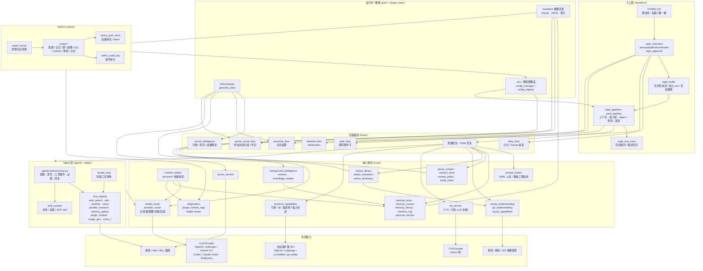

# nonebot-plugin-shiro-personification

基于 NoneBot2 与 OneBot V11 的 **拟人化群聊插件**。围绕群聊与私聊上下文构建有人设、有作息、有长期记忆的回复体验，支持 Agent 工具调用、联网研究、风格学习、主动私聊、贴图、用户画像、TTS 语音、Qzone 说说等能力。

## 目录

- [特性](#特性)
- [架构图](#架构图)
- [架构说明](#架构说明)
- [安装](#安装)
- [快速上手](#快速上手)
- [人设 YAML 模板](#人设-yaml-模板)
- [配置项概览](#配置项概览)
- [常用命令](#常用命令)
- [联动与兼容](#联动与兼容)
- [更新日志](#更新日志)
- [License](#license)

## 特性

- **群聊 / 私聊回复**：随机插话、戳一戳响应、私聊上下文记忆，支持作息模拟与情绪状态
- **Agent 工具调用**：联网搜索、Wiki/Fandom、天气、新闻、群信息、好友申请、定时任务、联网搜图直发、统一图片生成
- **并行研究**：复杂查询和生图准备时并发聚合联网、Wiki、图片、视觉资料，最多 6 个子 Agent
- **长期记忆**：用户画像、记忆衰减、记忆宫殿、群聊风格学习、话题摘要、上下文压缩
- **主动行为**：主动私聊、群空闲主动发话、Qzone 说说、远程 skill 审批
- **多模态**：贴图库自动标注、语义选图、视觉分析、GIF 动态表情理解、视频理解、可选 LLM 决策的 TTS 语音回复
- **拟人发送层**：打字延迟、碎片化回复、跨楼引用、多人混聊 @、沉默贴表情、戳一戳回拍、私聊输入状态
- **WebUI 运维**：内置管理后台、设备审批、功能体检、真实交互测试、消息 Trace 独立页、Agent 过程摘要、配置热更新、插件更新管理
- **人设模板构建**：WebUI / QQ 命令共用构建链路，支持阶段进度、历史、导出和一键应用
- **可扩展**：内置 skillpack 体系，支持本地 / 远程 skill 加载，可对接 MCP 桥
- **插件调用器**：可选让 Agent 代执行同 bot 其它插件命令并转述结果，默认关闭，支持 allowlist / blocklist
- **多 Provider 路由**：主模型 + 轻量模型 + 画像模型 + 风格模型 + 回退模型独立配置

## 架构图


```mermaid
flowchart TB
    %% ===== 入口层 =====
    subgraph Entry["入口层 (handlers/)"]
        OB["OneBot V11<br/>群消息 / 私聊 / 戳一戳"]
        Matchers["reply_matchers<br/>persona/admin/runtime/tts<br/>login_approval"]
        Buffer["reply_buffer<br/>合并短消息 / 抢占 cue / 复读跟随"]
        Pipeline["reply_pipeline / yaml_pipeline<br/>上下文→语义帧→Agent→审阅→发送"]
        Trace["reply_turn_trace<br/>阶段耗时 / 最近回合"]
        OB --> Matchers --> Buffer --> Pipeline --> Trace
    end

    %% ===== 流程编排 =====
    subgraph Flows["流程编排 (flows/)"]
        ChatFlow["普通回复 / YAML 回复"]
        ProactiveFlow["proactive_flow<br/>主动私聊"]
        StyleFlow["style_flow<br/>群风格学习"]
        DiaryFlow["diary_flow<br/>日记 / Qzone 说说"]
        QzoneFlow["qzone_social_flow<br/>好友动态扫描 / 评论"]
        SocialFlow["social_intelligence<br/>问候 / 资讯 / 话题跟进"]
        BlacklistFlow["blacklist_flow<br/>moderation"]
    end

    %% ===== Agent 与技能 =====
    subgraph Agent["Agent 层 (agent/ + skills/)"]
        Loop["agent/runtime/runner.py<br/>意图→改写→工具循环→证据→回复"]
        SimpleLoop["simple_loop<br/>轻量工具调用"]
        Tools["tool_registry<br/>web_search · wiki · weather · news<br/>parallel_research · memory_palace<br/>plugin_invoker · image_gen · vision_*"]
        Custom["skill_runtime<br/>本地 / 远程 / MCP skill"]
        Loop --> Tools
        SimpleLoop --> Tools
        Loop --> Custom
    end

    %% ===== 核心服务 =====
    subgraph Core["核心服务 (core/)"]
        RuntimeBuilder["runtime_builder<br/>services/* 依赖装配"]
        ProviderRouter["model_router<br/>provider_router<br/>主/轻量/画像/风格/回退"]
        PromptLoader["prompt_loader<br/>YAML 人设 / 基础三观底线"]
        Memory["memory_store · memory_curator<br/>memory_decay · memory_rag<br/>persona_service"]
        Context["group_context · session_store<br/>context_policy · entity_index"]
        Sticker["sticker_library<br/>sticker_semantics<br/>meme_dictionary"]
        Media["media_understanding<br/>gif_understanding<br/>visual_capabilities"]
        TTS["tts_service<br/>(TTS / 可选 LLM 决策)"]
        Humanize["protocol_capabilities<br/>引用 / @ / 贴表情 / 输入状态"]
        Diagnostics["diagnostics<br/>plugin_runtime_logs<br/>health routes"]
        Background["background_intelligence<br/>evolves · knowledge_builder"]
        Qzone["qzone_service"]
    end

    %% ===== WebUI =====
    subgraph WebUI["WebUI (webui/)"]
        Static["static/*.js/css<br/>管理后台前端"]
        Routes["routes/*<br/>配置 / 记忆 / 群 / 画像 / QQ / QZone / 体检 / 日志"]
        Auth["webui_auth_store<br/>设备审批 / token"]
        Audit["webui_audit_log<br/>操作审计"]
        Static --> Routes --> Auth
        Routes --> Audit
    end

    %% ===== 数据与运行时 =====
    subgraph Runtime["运行时 / 数据 (jobs/ + plugin_data/)"]
        Scheduler["APScheduler<br/>(periodic_jobs)"]
        DataDir["localstore 数据目录<br/>SQLite · JSON · 索引"]
        Config[".env / 群配置覆盖<br/>config_manager / config_registry"]
    end

    %% ===== 外部依赖 =====
    subgraph External["外部能力"]
        LLM["LLM Provider<br/>OpenAI / Anthropic / Gemini CLI<br/>Codex / Claude Code / Antigravity"]
        Vision["视觉 / 视频 / GIF 摘要模型"]
        TTSApi["TTS Provider<br/>(mimo 等)"]
        Web["搜索 / Wiki / 60s / 图源"]
        OneBotExt["协议端扩展 API<br/>NapCat / Lagrange / LLOneBot / go-cqhttp"]
    end

    Pipeline --> ChatFlow --> Agent
    Pipeline --> StyleFlow
    Matchers --> ProactiveFlow
    Matchers --> DiaryFlow
    Matchers --> QzoneFlow
    Scheduler --> SocialFlow
    Matchers --> BlacklistFlow

    RuntimeBuilder --> ProviderRouter
    RuntimeBuilder --> Memory
    RuntimeBuilder --> Diagnostics
    Agent --> ProviderRouter
    ChatFlow --> PromptLoader
    ChatFlow --> Memory
    ChatFlow --> Context
    ChatFlow --> Sticker
    ChatFlow --> Media
    ChatFlow --> TTS
    ChatFlow --> Humanize
    WebUI --> Diagnostics
    WebUI --> Config

    ProviderRouter --> LLM
    Tools --> Web
    Sticker --> Media --> Vision
    TTS --> TTSApi
    Humanize --> OneBotExt
    Background --> Memory
    Qzone --> Web

    Scheduler --> ProactiveFlow
    Scheduler --> Background
    Scheduler --> Qzone
    Scheduler --> QzoneFlow
    Config --> ProviderRouter
    Config --> Pipeline
    DataDir --- Memory
    DataDir --- Context
    DataDir --- Sticker
    DataDir --- WebUI
```

## 架构说明

- `nonebot_plugin_personification/__init__.py` 是发布包入口：注入 `plugin.personification` 兼容命名空间、加载 localstore/htmlrender、构建 runtime、注册 matcher/flow/job/WebUI。
- `handlers/reply_buffer.py` 与 `handlers/reply_pipeline/processor.py` 是普通群聊/私聊主链路；YAML 回复走 `handlers/yaml_pipeline/processor.py`，两条路径共享语义、情绪、视觉、TTS、贴图和发送层约束。
- `agent/runtime/runner.py` 是 LLM-led 工具循环：模型决定意图、是否查证、调用哪些工具、证据够不够以及最终回复；代码只做编排、预算、fallback 和持久化。
- `core/runtime_builder.py` 与 `core/services/*` 装配 provider、tool registry、记忆、画像、贴图、WebUI 和运行时 IO；配置字段由 `config.py`、`core/config_registry.py`、`core/config_registry_extra.py` 和 [CONFIG.md](./CONFIG.md) 对齐。
- WebUI 后端在 `webui/routes/*`，前端静态资源在 `webui/static/*`，支持配置、记忆、群/QQ/QZone、技能、体检、日志、审计和设备审批。
- 发布包特有适配保留在包内：`web_console_api.py`、`plugin_data.py`、`nonebot_plugin_personification` 包名到 `plugin.personification` 的兼容导入，以及包内 `data/meme_seeds.json`。

## 安装

```bash
nb plugin install nonebot-plugin-shiro-personification
```

或：

```bash
pip install nonebot-plugin-shiro-personification
```

### 环境要求

- Python `>=3.10`
- NoneBot2 `>=2.2`
- `nonebot-adapter-onebot` `>=2.4`
- 自动依赖：`apscheduler` / `localstore` / `htmlrender` / `openai` / `anthropic` / `httpx` / `Pillow` / `PyYAML`

## 快速上手

最小 `.env`：

```env
# —— 主模型（必填）——
personification_api_type="openai"
personification_api_url="https://api.openai.com/v1"
personification_api_key="sk-xxxx"
personification_model="gpt-4o-mini"

# —— 启用的群（按需）——
personification_whitelist=["123456789","987654321"]

# —— 人设：建议指向 YAML 模板（可选）——
personification_prompt_path="data/personas/your_persona.yaml"
```

> 数据目录默认走 `nonebot-plugin-localstore` 的 `get_plugin_data_dir()`；如需兼容旧路径，显式设置 `personification_data_dir`。

## 人设 YAML 模板

完整模板见 [`examples/persona_template.yaml`](./examples/persona_template.yaml)，把它复制到 `data/personas/your_persona.yaml`，然后在 `.env` 中通过 `personification_prompt_path` 指向该文件即可。

模板覆盖以下字段：

| 字段 | 用途 |
| --- | --- |
| `name` | 角色名（识别用） |
| `tts.voice` / `tts.style` / `tts.user_hint` | 朗读音色与风格描述，会被 TTS 决策器读取 |
| `status` | 初始内心状态（每轮被状态更新提示词覆写） |
| `nick_name` | 触发回复的昵称 / 别名 / @ 列表 |
| `ack_phrases` | 长任务/超时占位短语，例如「等一下哦」 |
| `initial_message` | 首次进群或被拉群时的招呼用语 |
| `mute_keyword` | 触发临时禁言（短期黑名单）的关键词 |
| `input` | 每轮回复的用户提示词模板，可用 `{time}` `{history_new}` `{history_last}` `{status}` `{trigger_reason}` `{schedule_instruction}` 等占位符 |
| `system` | 主 system prompt，决定角色身份/边界/口吻；可使用 `{system_schedule_instruction}` 注入作息表 |

最简形式（不写 `input`/`system` 的子键时，插件会回退到内置默认）：

```yaml
name: 示例角色
nick_name: ["小明", "@小明"]
system: |
  你是群里的小明，一个普通学生。说话简短，不要客服腔。
```

加载逻辑见 `core/prompt_loader.py`：YAML 文件按 `_YAML_CACHE_TTL=300s` 缓存并按 mtime 失效，编辑后 5 分钟内会自动生效，也可以通过 `clear_yaml_prompt_cache()` 手动清。

## 配置项概览

> 完整配置表（每一项的示例 / 默认值 / 备注）见 [CONFIG.md](./CONFIG.md)。下表只列出按主题归类的入口，方便对照排查。

### 1. 主模型与路由

| 类别 | 关键配置 |
| --- | --- |
| 主模型 | `personification_api_type` / `_api_url` / `_api_key` / `_model` |
| 多 provider 池 | `personification_api_pools`（JSON 字符串） |
| 轻量任务模型 | `personification_lite_model`（intent 分类、回复 review、图片分类） |
| 专用模型 | `personification_persona_model` / `_style_api_model` / `_state_model` / `_compress_model` |
| 主流程回退 | `personification_fallback_*` 一组（API/模型/凭证） |
| 回复审阅 | `personification_response_review_enabled` / `_response_review_model_role` |
| Codex OAuth | `personification_codex_auth_path`（`api_type="openai_codex"` 时） |
| 思考模式 | `personification_thinking_mode` / `_state_thinking_mode` / `_thinking_budget` |

### 2. 数据目录与基础行为

| 类别 | 关键配置 |
| --- | --- |
| 数据目录 | `personification_data_dir`（留空自动用 localstore） |
| 白名单与开关 | `personification_whitelist` / `_global_enabled` / `_tts_global_enabled` |
| 触发概率 | `personification_probability` / `_poke_probability` |
| 时区与作息 | `personification_timezone` / `_schedule_global` |
| 输出长度 | `personification_max_output_chars` / `_max_segment_chars` |
| 系统提示词 | `personification_system_prompt` / `_prompt_path` / `_system_path` |
| 基础判断底线 | `personification_core_values_enabled` / `_core_values_prompt` |

### 3. Agent / 联网 / 技能

| 类别 | 关键配置 |
| --- | --- |
| Agent 主开关 | `personification_agent_enabled` / `_agent_max_steps` / `_response_timeout` |
| 联网粒度 | `personification_builtin_search` / `_model_builtin_search_enabled` / `_tool_web_search_enabled` / `_tool_web_search_mode` / `_web_search_always` |
| 自定义 skill | `personification_skills_path` / `_skill_sources` / `_skill_remote_enabled` / `_skill_cache_dir` / `_skill_update_interval` / `_skill_default_timeout` / `_skill_mcp_timeout` / `_skill_allow_unsafe_external` / `_skill_require_admin_review` / `_use_skillpacks` |
| GitHub | `personification_github_token` |
| 插件调用器 | `personification_plugin_invoker_enabled` / `_plugin_invoker_allowlist` / `_plugin_invoker_blocklist` / `_plugin_invoker_capture_timeout` |
| 插件知识库 | `personification_plugin_knowledge_build_enabled` |
| 并行研究 | `personification_parallel_research_enabled` / `_lookup_enabled` / `_max_workers` / `_worker_timeout` / `_total_timeout` / `_max_tool_rounds` / `_pages_per_worker` |

### 4. 搜索 / Wiki / 外部 API

| 类别 | 关键配置 |
| --- | --- |
| 天气 / 新闻 | `personification_weather_api` / `_60s_api_base` / `_60s_local_api_base` / `_60s_enabled` |
| Wiki | `personification_wiki_enabled` / `_wiki_fandom_enabled` / `_fandom_wikis` |
| 图片搜索 | `personification_image_search_api_key` |

### 5. 视觉 / 图片生成 / 贴图

| 类别 | 关键配置 |
| --- | --- |
| 图片输入 | `personification_image_input_mode` / `_image_detail` |
| 视觉回退 | `personification_vision_fallback_enabled` / `_vision_fallback_provider` / `_vision_fallback_model` |
| GIF 理解 | `personification_gif_understanding_enabled` / `_gif_understanding_timeout` / `_gif_max_bytes` / `_gif_sample_frames` / `_gif_max_per_turn` / `_gif_summary_cache_enabled` |
| 视频理解 | `personification_video_understanding_enabled` / `_video_fallback_*` |
| 图片生成 | `personification_image_gen_enabled` / `_image_gen_model` / `_image_gen_background_enabled` / `_image_gen_timeout` |
| 贴图库 | `personification_sticker_path` / `_sticker_probability` / `_sticker_semantic` |
| 贴图标注 | `personification_labeler_enabled` / `_labeler_api_*` / `_labeler_model` / `_labeler_concurrency` |
| 协议扩展 | `personification_protocol_extensions` |
| 拟人发送层 | `personification_humanize_typing_enabled` / `_humanize_fragment_style` / `_humanize_quote_reply_enabled` / `_humanize_reaction_enabled` / `_humanize_at_enabled` / `_humanize_input_status_enabled` |

### 6. 用户画像 / 长期记忆 / 后台

| 类别 | 关键配置 |
| --- | --- |
| 画像 | `personification_persona_enabled` / `_persona_history_max` / `_persona_data_path` / `_persona_snippet_max_chars` / `_persona_prompt_max_chars` |
| 好感映射 | `personification_favorability_attitudes` |
| 长期记忆 | `personification_memory_enabled` / `_memory_palace_enabled` / `_memory_decay_enabled` / `_memory_consolidation_enabled` / `_memory_recall_top_k` / `_memory_rag_enabled` / `_memory_vector_backend` |
| Embedding | `personification_embedding_provider` / `_embedding_api_url` / `_embedding_api_key` / `_embedding_model` / `_embedding_batch_size` |
| 后台智能 | `personification_background_intelligence_enabled` / `_background_evolves_enabled` / `_background_crystals_enabled` / `_background_max_llm_tasks_per_hour` / `_per_day` / `_background_debounce_seconds` |

### 7. 上下文 / 历史 / 压缩

| 类别 | 关键配置 |
| --- | --- |
| 历史长度 | `personification_history_len` / `_private_history_turns` |
| 压缩策略 | `personification_compress_threshold` / `_compress_keep_recent` |
| 过期时间 | `personification_message_expire_hours` / `_group_context_expire_hours` / `_group_summary_expire_hours` |

### 8. TTS 语音

| 类别 | 关键配置 |
| --- | --- |
| 总开关 | `personification_tts_enabled` / `_tts_global_enabled` / `_tts_auto_enabled` / `_tts_auto_probability` |
| LLM 决策 | `personification_tts_llm_decision_enabled` / `_tts_llm_decision_model_role` / `_tts_decision_timeout` |
| 安全策略 | `personification_tts_builtin_safety_enabled` / `_tts_forbidden_policy` |
| Provider | `personification_tts_api_url` / `_tts_api_key` / `_tts_model` |
| 音色模式 | `personification_tts_mode`（preset / design / clone）+ `_tts_default_voice` / `_tts_voice_design_prompt` / `_tts_voice_clone` / `_tts_voice_clone_path` |
| 输出 | `personification_tts_default_format` / `_tts_max_chars_per_segment` / `_tts_timeout` |
| 命令与场景 | `personification_tts_command_prefixes` / `_tts_private_force_auto` / `_tts_group_default_enabled` / `_tts_style_planner_enabled` |

### 9. 主动行为 / 群节奏 / 风格学习

| 类别 | 关键配置 |
| --- | --- |
| 主动私聊 | `personification_proactive_enabled` / `_proactive_threshold` / `_proactive_daily_limit` / `_proactive_interval` / `_proactive_probability` / `_proactive_idle_hours` / `_proactive_unsuitable_prob` / `_proactive_without_signin` |
| 群空闲发话 | `personification_group_idle_enabled` / `_group_idle_minutes` / `_group_idle_check_interval` / `_group_idle_daily_limit` |
| 接话节奏 | `personification_group_chat_active_minutes` / `_group_chat_follow_probability` |
| 风格分析 | `personification_group_style_auto_analyze_threshold` / `_min_new_messages` / `_cooldown_hours` |
| 静音时段 | `personification_group_quiet_hour_start` / `_group_quiet_hour_end` |
| 群摘要 | `personification_group_summary_enabled` |

### 10. 好友 / 黑名单 / Qzone

| 类别 | 关键配置 |
| --- | --- |
| 好友申请 | `personification_friend_request_enabled` / `_friend_request_min_fav` / `_friend_request_daily_limit` |
| 反 KY 保护 | `personification_hot_chat_min_pass_rate` |
| 临时黑名单 | `personification_blacklist_duration` |
| Qzone 说说 | `personification_qzone_enabled` / `_qzone_cookie` / `_qzone_proactive_enabled` / `_qzone_check_interval` / `_qzone_daily_limit` / `_qzone_monthly_limit` / `_qzone_probability` / `_qzone_min_interval_hours` / `_qzone_agent_max_steps` |

### 11. WebUI / 体检 / 日志

| 类别 | 关键配置 |
| --- | --- |
| 设备审批 | `personification_webui_require_device_approval` / `_webui_expose_admin_list` |
| 插件日志 | `personification_webui_log_retention_days` / `_webui_log_max_entries` / `_webui_log_capture_level` |
| 回复 trace | `personification_turn_trace_enabled` |
| 真实交互体检 | `personification_webui_test_group_id` / `_webui_test_user_id` |

## 常用命令

| 命令 | 说明 |
| --- | --- |
| `拟人帮助` | 查看插件命令清单 |
| `查看配置` | 查看当前群/全局生效的核心配置 |
| `拟人开关 [开启/关闭]` | 群级总开关 |
| `开启拟人` / `关闭拟人` | 别名形式 |
| `拟人语音 [开启/关闭]` | 群级 TTS 开关 |
| `拟人联网 [开启/关闭]` | 联网搜索开关 |
| `拟人主动消息 [开启/关闭]` | 主动私聊开关 |
| `开启表情包` / `关闭表情包` | 贴图发送开关 |
| `拟人作息 [开启/关闭/全局开启/全局关闭]` | 作息模拟控制 |
| `学习群聊风格` | 触发一次群风格分析 |
| `查看群聊风格 [群号]` | 查看分析结果 |
| `查看画像` / `刷新画像` | 用户画像查询/重建 |
| `群好感` / `设置群好感 [群号] [数值]` | 好感度运维 |
| `清除记忆 [全局/@用户/用户ID]` | 按维度清记忆 |
| `完全清除记忆` | 清掉全部记忆数据 |
| `永久拉黑 [用户ID/@用户]` / `取消永久拉黑 ...` | 黑名单管理 |
| `发个说说` | 立即发一条 Qzone 说说 |
| `/persona help` | 画像/人设管理子命令入口 |

## 联动与兼容

- `nonebot-plugin-htmlrender` 作为默认依赖声明；不可用时相关渲染能力会自动降级，不影响主插件加载。
- `nonebot-plugin-shiro-signin` 暂未发布，因此当前不会作为安装文档中的可选 extra 提供。
- 未安装签到联动插件时，好感度、称号、黑名单等联动能力会自动降级，不影响主插件加载。
- 依赖其他插件时统一使用 `require(...)` 声明，避免因普通 `import` 提前导入导致插件加载失败。

## 更新日志

### 0.6.2

- **全量同步源仓库 `f6c1427` 更新**：迁移 0.6.1 之后的 Agent runner 拆分、自适应预算 shadow/adaptive 模式、最终回复质量闭环、短期话题状态、ACG 指代查证、联网搜图直发和统一 `generate_image` 绘图工具。
- **补齐 WebUI 与运维能力**：同步消息 Trace 独立页、Agent 过程摘要、配置中心 provider 模型探测下拉、仪表盘明细、插件知识库全量源码覆盖统计、工具健康巡检、WebUI 插件更新管理和人设模板构建历史/导出/一键应用。
- **迁移 QQ 与社交功能增量**：同步 QQ 表情发送工具、群成员外号/QQ 资料快照、插件内好感度、QZone 好友动态转发与额度记录、群作息可编辑生成、GIF 表情包打标和贴图库研究复核。
- **更新发布仓库链接**：`pyproject.toml`、`PluginMetadata.homepage`、README 里的项目主页/issue/repository 统一指向 `https://github.com/luojisama/nonebot-plugin-shiro-personification`。
- **保留发布包适配并扩展测试**：继续保留包名兼容命名空间、`web_console_api.py`、`plugin_data.py`、`data/meme_seeds.json` 与 localstore/htmlrender 降级加载；同步新增回放样本和 7 月以来的 Agent/WebUI/QZone/工具测试。

### 0.6.1

- **同步本地 `personification` 最新开发版**：迁移 0.6.0 后的 WebUI 体检、GIF 理解、基础三观提示词、Agent 查证约束、轻量路由与耗时追踪等更新。
- **修复插件元数据 homepage**：`PluginMetadata.homepage` 改为发布仓库主页，避免插件校验报告项目主页无法访问；当前链接统一指向 `https://github.com/luojisama/nonebot-plugin-shiro-personification`。
- **补齐发布仓库测试套件**：迁移本地测试与回放样本到发布仓库根目录，并增加测试命名空间适配，便于在包仓库布局下验证 `plugin.personification` 兼容入口。
- **补全文档与架构说明**：README 对齐当前运行时代码、WebUI、体检日志、GIF 理解、插件调用器和拟人发送层；CONFIG.md 补齐 0.6.1 新增配置字段。
- **保留发布版专属适配**：继续保留 `web_console_api` 桥接、`nonebot_plugin_personification` 到 `plugin.personification` 的兼容命名空间，以及 localstore/htmlrender 的加载顺序保护。

### 0.6.0

- **全量同步本地 `personification` 开发版**：以当前开发分支为准重建发布包代码，补齐自 0.5.3 以来的全部新功能，并保留发布版特有的 `web_console_api` 桥接与命名空间适配。
- **内置 WebUI 看板**：随插件挂载到 `http://<host>:<port>/personification/`，提供记忆宫殿力导向图、群管理与白名单、远程 skill 安装、审计日志、配额与性能指标等可视化能力（设备 token 自动鉴权，启动时清理过期 token）。
- **联网检索增强**：默认启用模型原生联网检索（Gemini / Anthropic / OpenAI），并内置免配置的免费搜索链（Wikipedia / SearXNG / DuckDuckGo）；新增可配置的 HTTP 出站代理以缓解 DNS 污染。
- **新增 `game_info` 游戏资讯 skill**：聚合主流网游与单机的更新公告、攻略、剧情与技巧，多源并行拉取（覆盖 Steam 与非 Steam 平台官方源 + 社区站点）。
- **四层记忆体系（P4）**：分层召回与摘要反向强化，记忆按可信度 / 敏感度分级并影响回复风格；附带记忆分层迁移脚本。
- **社交智能框架**：清晨问候、定时资讯、话题延续、节日与生日祝福等主动场景，支持按用户的每日配额与冷却，可按场景独立开关。
- **会话线程追踪与梗词典**：群消息自动归入话题线程，结合群内梗词典做更贴合语境的插话判断。
- **QQ 空间联动**：好友动态扫描与回复、入站轮询、AI 日记自动生成与发布，启动期自动刷新 QZone Cookie。
- **Provider 动态优先级与健康路由**：被动统计时延与成功率，配合指数退避与冷却降级；新增 Antigravity CLI Provider（显式代理配置、基于系统 keyring 的 OAuth 刷新、v1internal 协议、TUN 代理模式）。
- **可选 git 自动更新**：默认关闭，开启后按间隔检查并通过多镜像并行探测拉取更新，失败自动回退 ghproxy。
- **图片域名白名单**：可配置用户图片输入的安全域名白名单。
- 依赖更新：新增 `fastapi`（WebUI）、`beautifulsoup4`（网页解析）、`python-dotenv`（配置读写）。

### 0.5.3

- 同步本地 `personification` 新增的可配置 LLM 回复审阅：默认关闭，可选择 `intent/review/agent/sticker` 模型角色。
- TTS 的 LLM 决策默认改为关闭，并新增 `personification_tts_llm_decision_model_role` 控制审查模型角色。
- 修复 `nonebot_plugin_localstore` 加载顺序，避免插件加载后测试器再次 `require()` 时报 “not loaded as a plugin”。
- 后台图片发送忽略 NapCat `retcode=1200 invoke timeout` 这类通常已送达的超时，避免补发误导性的失败提示。

### 0.5.2

- 同步本地 `personification` 新功能：并行研究工具、图片生成 skill、模型路由、回复风格策略与最新测试。
- TTS 支持由 LLM 在合成前决策 `voice/text/block`，并加入内置安全策略与自定义禁读策略。
- 修复 `nonebot_plugin_htmlrender` 加载顺序，避免普通 import 提前导入后再次 `require()` 时报错。
- 去除普通聊天意图兜底中的关键词语义判断，保持回复、YAML、TTS 与贴图路径由统一语义帧驱动。

### 0.5.1

- 将本地 `personification` 的当前功能面、测试与配置项完整同步到发布包 `nonebot-plugin-shiro-personification`。
- 新增稳定的 `web_console_api` 接口，供 `nonebot-plugin-shiro-web-console` 在在线版与本地版之间统一读取状态、全局配置、群配置与统计信息。
- 补齐轻量模型、视觉/视频理解回退、插件知识库构建、图片输入模式等配置文档，并修正文档中对数据目录配置的旧说明。

### 0.5.0

- 完整迁移本地 `personification` 功能到发布包，补齐长期记忆、记忆宫殿、TTS、远程 skill 审批、插件知识库等能力。
- 修复插件商店加载问题，避免 `nonebot_plugin_htmlrender` 因提前导入导致后续 `require()` 失败。
- 统一改为使用 `nonebot-plugin-localstore` 的 `get_plugin_data_dir()` 管理插件数据目录。
- 放宽 `pydantic` 依赖限制，并修正配置模型以兼容 `pydantic v1/v2`。
- 增补完整配置文档，覆盖全部配置项、示例写法、默认值与备注。
- 文档中明确说明签到联动插件暂未发布，相关能力仅保留兼容降级逻辑。

### 0.4.0

- 完整迁移本地 `personification` 开发版架构到在线版包。
- 新增 Agent 工具调用、用户画像、自定义 skills、群摘要与上下文压缩。
- 新增群空闲主动发话、好友申请判定、贴图库自动标注与语义选图。

## License

[MIT](./LICENSE)
